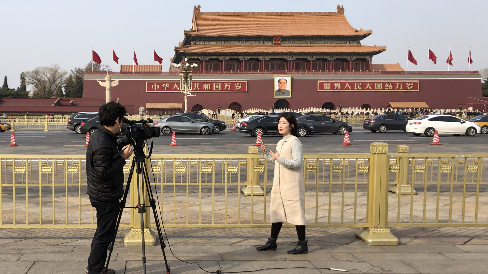

Welcome! I am a PhD candidate and Irish Research Council Postgraduate Scholar in the <a href="https://www.ucd.ie/spire/" target="_blank">School of Politics and International Relations</a> at University College Dublin. I use mixed methods, including computational text analysis, experiments, and interviews, to study forms of authoritarian information manipulation, and its effects and consequences. My interest in these issues is informed by a decade-long career as a journalist and foreign correspondent for the Singapore public broadcaster, <a href="https://www.channelnewsasia.com/international" target="_blank">CNA</a>. Please feel free to [contact me](mailto:linette.lim@ucdconnect.ie) if you have any questions or would like to discuss potential projects.

